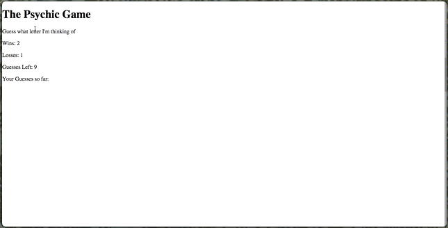
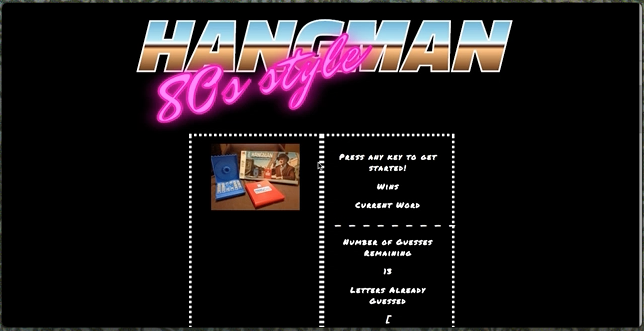

# Week 3 Assignment

### Overview
In this assignment, you'll create one of two possible computer games: Hangman or Psychic. These apps will run in the browser, and feature dynamically updated HTML powered by your JavaScript code.

### Remember

You will be fully capable of doing this homework by the end of Saturday's class.

### Before You Begin
1. Create a new GitHub repo called `Hangman-Game` or `Psychic-Game`, in accordance with the assignment you choose to complete. Then, clone it to your computer.

2. Inside your local git repository, create an `index.html`.

  * Also create `composer.json` and `index.php` files, if you are deploying to Heroku.

  * Fill in the appropriate content in the composer.json and index.php files to be able to deploy your game to Heroku when it is finished.

3. While still in your local git repo, create a directory called `assets`.
  * `cd` your way into the `assets` folder, then make three additional folders: `javascript`, `css` and `images`.
    * In the `javascript` folder, make a file called `game.js`. Use the `src` attribute of the `script` tag to link to this file, rather than embedding the code directly in your HTML document.
    * In the `css` folder, make a file called `style.css`.
    * Also in the `css` folder, make a file called `reset.css`. Paste into it the code from the Meyerweb reset stylesheet. If you opt to use Bootstrap instead of writing your own CSS, skip this step, and simply include a link to Bootstrap via CDN.
    * In the `images` folder, save whatever images you plan on using.

4. Push the above changes to GitHub.

5. Choose whichever game you'd like to build. Making the Psychic game will prove less challenging than coding Hangman. However, as the challenge of the Hangman exercise provides  a more comprehensive review of this week's material, we suggest attempting that assignment first.

  * Note: There's no shame if you'd prefer submitting Psychic&mdash;it's still a proper challenge.

6. Push your selected game to `gh-pages`. Alternatively, if using Heroku:

  * `heroku login`
  * `heroku create`
  * `git push heroku master`

## Option One: Psychic Game (Basic)

1. [Watch the demo](psychic-game-demo.mov).

2. You're going to make a game just like the one in the video. Essentially, the app randomly picks a letter, and the user has to guess which letter the app chose. Put the following text on your page:

  * Guess what letter I'm thinking of

  * Wins: (# of times the user has guessed the letter correctly)

  * Losses: (# of times the user has failed to guess the letter correctly after exhausting all guesses)

  * Guesses Left: (# of guesses left. This will update)

  * Your Guesses So Far: (the specific letters that the user typed. Display these until the user either wins or loses.)

3. When the player wins, increase the Wins counter and start the game over again (without refreshing the page).

4. When the player loses, increase the Losses counter and restart the game without a page refresh (just like when the user wins).

## Option Two: Hangman Game (Challenge - Recommended)

1. [Watch the demo](hangman-game-demo.mov).

2. Choose a theme for your game! In the demo, we picked an 80s theme: 80s questions, 80s sound and an 80s aesthetic. You can choose any subject for your theme, though, so be creative!

3. Use key events to listen for the letters that your players will type.

4. Display the following on the page:

  * Press any key to get started!

  * Wins: (# of times user guessed the word correctly).

    * If the word is `madonna`, display it like this when the game starts: `_ _ _ _ _ _ _`.

    * As the user guesses the correct letters, reveal them: `m a d o _  _ a`.

  * Number of Guesses Remaining: (# of guesses remaining for the user).

  * Letters Already Guessed: (Letters the user has guessed, displayed like `L Z Y H`).

5. After the user wins/loses the game should automatically choose another word and make the user play it.

##### Hangman Game Bonuses

1. Play a sound or song when the user guesses their word correctly, like in our demo.
2. Write some stylish CSS rules to make a design that fits your game's theme.
3. **HARD MODE:** Organize your game code as an object, except for the key events to get the letter guessed. This will be a challenge if you haven't coded with JavaScript before, but we encourage anyone already familiar with the language to try this out.
  * Save your whole game and its properties in an object.
  * Save any of your game's functions as methods, and call them underneath your object declaration using event listeners.
  * Don't forget to place your global variables and functions above your object.
    * Remember: global variables, then objects, then calls.
  * Definitely talk with a TA or your instructor if you get tripped up during this challenge.

-------
#### A Few Tips

1. **IMPORTANT:** Whichever assignment you choose, code your game one piece at a time! Code all of your apps one piece at a time. *Always code one piece at a time!*
  * Pseudocode your program and break the app down into tiny, manageable fragments. This will make the coding process much less frustrating and a veritable Mach number faster. Otherwise, you'll be chipping away at a giant chunk of abstraction for way too many hours.
    * The ability to solve a large problem by treating it as a set of smaller ones is the hallmark of a strong programmer. Best start adapting this into your development routine now, to better prepare for your more complex future projects.
    * Remember:
      1. Split the whole program into many distinct, pseudocoded problems.
      2. Focus on one of the smaller problems and solve it.
      3. Only when you solve one problem should you then move onto your next problem.

2. When you encounter bugs (and we all do), `console.log` will become your best friend. Regularly check your console to make sure your app is spitting out the right values.

    * As a more advanced&mdash;but more powerful&mdash;alternative, feel free to experiment with the [Chrome DevTools Debugger](https://developers.google.com/web/tools/chrome-devtools/).

2. Try your best to deliver a 'working/playable game' by the end of the deadline. If you're not making progress with Hangman, switch gears to the Psychic game. Contact your TA/Instructor if you're not making progress after 2 hours. We're here to help!

3. Substance over style! Submitting a working game matters more that making a broken app that at least looks pretty. We're focusing on game mechanics, not just on the look and feel of your app.
  * That said, coding a functional app that also looks pretty would be impressive.

4. Always commit your work and back it up with GitHub pushes. You don't want to lose hours of your work because you didn't push it to GitHub every half hour or so.

    * **Commit often**.

5. Turn in anything you have! Even if you don't finish, we still want to see what you were able to accomplish in the time we gave you. This will help us know what concepts we could help you with, as well as what topics we should focus on in the coming lectures.

-------

### One More Thing
If you have any questions about this project or about the material we covered, the instructor and your TAs are only a Slack message away.

**Good Luck!**

---

### Copyright

Coding Boot Camp &copy; 2016. All Rights Reserved.
