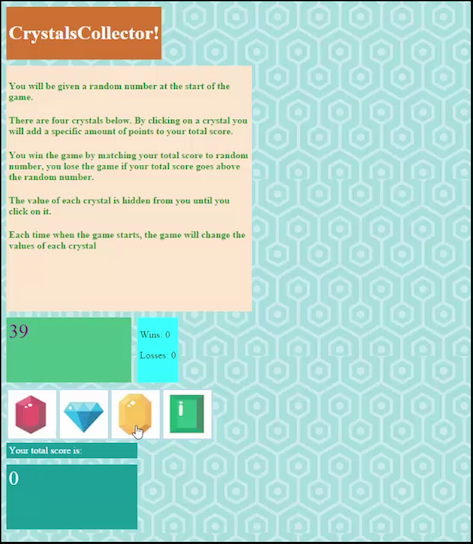
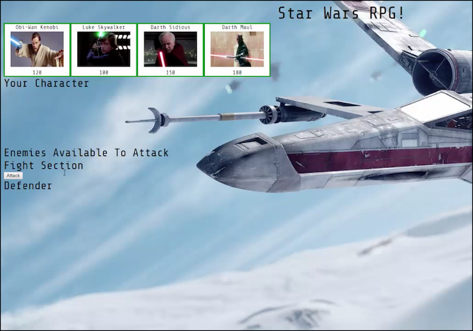

# Week 4 Assignment

### Overview

In this assignment, you'll create another fun and interactive game for web browsers. This time, your app must dynamically update your HTML pages with the jQuery library.

### Remember

You will be fully capable of doing this homework by the end of Saturday's class.

### Before You Begin

1. Create a new GitHub repo called `week-4-game`, then clone it to your computer.

2. Inside the `week-4-game` folder, create the following: `index.html`, `composer.json` and `index.php`.
3. Place the appropriate content in the `composer.json` and `index.php` files, so you can deploy your game to Heroku.

4. Still inside the `week-4-game` directory, make a folder called `assets`.

   * Inside the `assets` directory, make three additional folders: `javascript`, `css` and `images`.
     * In the `javascript` folder, make a file called `game.js`.
     * In the `css` folder, make a file called `style.css`.
     * In the `css` folder, make a file called `reset.css`. Paste into it the code found from the Meyerweb Reset.
     * In the images folder, save any of the images you plan on using.

5. Push the above changes to GitHub. 

6. Choose whichever game you want to make from the choices below. The CrystalsCollector game is the recommended option, but if you are looking for an extra hard challenge then take a stab at the Star Wars exercise. (Note: Only choose the Star Wars Exercise if you are feeling very comfortable with the material covered in class. The Crystal Collector activity is plenty challenging enough!).

### Option One: CrystalsCollector Game (Recommended)

1. [Watch the demo](homework_demos/crystalsCollector_demo.mp4).

2. The player will have to guess the answer, just like in Hangman. This time, though, the player will guess with numbers instead of letters. 

3. Here's how the app works:

   * There will be four crystals displayed as buttons on the page.

   * The player will be shown a random number at the start of the game.

   * When the player clicks on a crystal, it will add a specific amount of points to the player's total score. 

     * Your game will hide this amount until the player clicks a crystal.
     * When they do click one, update the player's score counter.

   * The player wins if their total score matches the random number from the beginning of the game.

   * The player loses if their score goes above the random number.

   * The game restarts whenever the player wins or loses.

     * When the game begins again, the player should see a new random number. Also, all the crystals will have four new hidden values. Of course, the user's score (and score counter) will reset to zero.

   * The app should show the number of games the player wins and loses. To that end, do not refresh the page as a means to restart the game.

##### Option 1 Game design notes

* The random number shown at the start of the game should be between 19 - 120.

* Each crystal should have a random hidden value between 1 - 12.

### Option Two: Star Wars RPG Game (Challenge)

1. [Watch the demo](homework_demos/starwars_demo.mp4).

2. Here's how the app works:

   * When the game starts, the player will choose a character by clicking on the fighter's picture. The player will fight as that character for the rest of the game.

   * The player must then defeat all of the remaining fighters. Enemies should be moved to a different area of the screen.

   * The player chooses an opponent by clicking on an enemy's picture.

   * Once the player selects an opponent, that enemy is moved to a `defender area`.

   * The player will now be able to click the `attack` button.
     * Whenever the player clicks `attack`, their character damages the defender. The opponent will lose `HP` (health points). These points are displayed at the bottom of the defender's picture. 
     * The opponent character will instantly counter the attack. When that happens, the player's character will lose some of their `HP`. These points are shown at the bottom of the player character's picture.

3. The player will keep hitting the attack button in an effort to defeat their opponent.

   * When the defender's `HP` is reduced to zero or below, remove the enemy from the `defender area`. The player character can now choose a new opponent.

4. The player wins the game by defeating all enemy characters. The player loses the game the game if their character's `HP` falls to zero or below.

##### Option 2 Game design notes

* Each character in the game has 3 attributes: `Health Points`, `Attack Power` and `Counter Attack Power`.

* Each time the player attacks, their character's Attack Power increases by its base Attack Power. 
  * For example, if the base Attack Power is 6, each attack will increase the Attack Power by 6 (12, 18, 24, 30 and so on).
* The enemy character only has `Counter Attack Power`. 

  * Unlike the player's `Attack Points`, `Counter Attack Power` never changes.

* The `Health Points`, `Attack Power` and `Counter Attack Power` of each character must differ.

* No characters in the game can heal or recover Health Points. 

  * A winning player must pick their characters wisely by first fighting an enemy with low `Counter Attack Power`. This will allow them to grind `Attack Power` and to take on enemies before they lose all of their `Health Points`. Healing options would mess with this dynamic.

* Your players should be able to win and lose the game no matter what character they choose. The challenge should come from picking the right enemies, not choosing the strongest player.

- - -

### One More Thing

If you have any questions about this project or about the material we covered, the instructor and your TAs are only a Slack message away.

**Good Luck!**

## Copyright

Coding Boot Camp (C) 2016. All Rights Reserved.
