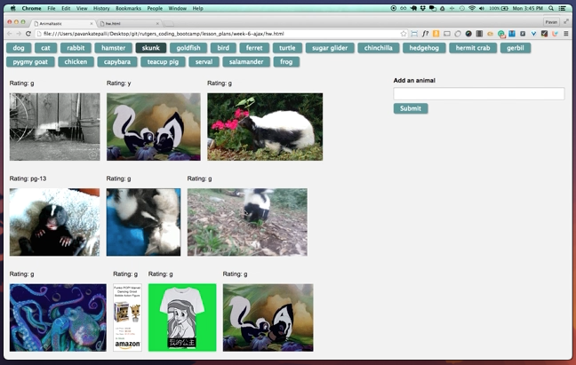

# GifTastic

### Overview

In this assignment, you'll use the GIPHY API to make a dynamic web page that populates with gifs of your choice. To finish this task, you must call the GIPHY API and use JavaScript and jQuery to change the HTML of your site.

### Before You Begin

1. **Hit the GIPHY API**

   * Fool around with the GIPHY API. [You can read more here](https://github.com/Giphy).

   * Be sure to read about these GIPHY parameters (hint, hint): 

     * `q`
     * `limit`
     * `rating`

   * Like many APIs, GIPHY requires developers to use a key to access their API data. Their public API Key is [provided here](https://github.com/Giphy/GiphyAPI#overview). 

2. **[Watch the demo video](homework_demo.mov)**

   * You should have a high-level understanding of how this assignment works before attempting to code it.

### Instructions

1. Before you can make any part of our site work, you need to create an array of strings, each one related to a topic that interests you. Save it to a variable called `topics`. 

   * We chose animals for our theme, but you can make a list to your own liking.

2. Your app should take the topics in this array and create buttons in your HTML.

   * Try using a loop that appends a button for each string in the array.

3. When the user clicks on a button, the page should grab 10 static, non-animated gif images from the GIPHY API and place them on the page. 

4. When the user clicks one of the still GIPHY images, the gif should animate. If the user clicks the gif again, it should stop playing.

5. Under every gif, display its rating (PG, G, so on). 

   * This data is provided by the GIPHY API.
   * Only once you get images displaying with button presses should you move on to the next step.

6. Add a form to your page takes the value from a user input box and adds it into your `topics` array. Then make a function call that takes each topic in the array remakes the buttons on the page.

7. **Rejoice**! You just made something really cool.

- - -

### One More Thing

If you have any questions about this project or the material we have covered, please post them in the community channels in slack so that your fellow developers can help you! If you're still having trouble, you can come to office hours for assistance from your instructor and TAs.

**Good Luck!**

## Copyright

Coding Boot Camp (C) 2016. All Rights Reserved.
